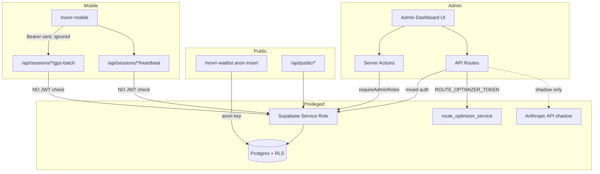

# MOVRR Admin — Enterprise Security Audit

**Engagement type:** Audit-first (no remediation performed)  
**Audit date:** 7 July 2026  
**Auditor role:** Principal Security Architecture & Production Readiness Review  
**Scope:** movrr-admin, movrr-mobile, movrr-waitlist, movrr (shared schema), route_optimizer_service, shared Supabase project  
**Classification:** Internal — Confidential

---

## Executive Summary

MOVRR Admin is a **well-intentioned, partially hardened** privileged operations platform with strong patterns in several areas (Zod env validation, admin MFA/AAL2 policy enforcement in `getAuthenticatedUser()`, LLM shadow-mode isolation, optimizer service token auth, scanner-safe auth callbacks). However, **it is not enterprise-grade, production-ready, or Rotterdam pilot launch-ready** in its current state.

The platform's most severe weakness is the **mobile GPS ingest trust boundary**: `/api/sessions/[id]/gps-batch` and `/api/sessions/[id]/heartbeat` accept writes using the **Supabase service role with no rider JWT validation**, while the mobile client sends a Bearer token that the server **ignores**. Combined with **client-controlled timestamps**, **incomplete anti-spoof logic**, and **permissive database RLS on reward ledger tables**, an attacker can forge rides, inflate rewards, and corrupt campaign impression data without authenticating as the session owner.

Additional systemic gaps include:

- **Dead edge middleware** — `proxy.ts` exists but `middleware.ts` does not; documented middleware auth never runs.
- **Application-only authorization** — service-role Supabase bypasses RLS on virtually all admin writes; defense-in-depth at the database layer is incomplete.
- **Split admin identity model** — `admin_users` (dashboard) vs `is_admin()` on `public.user.role` (RLS) are inconsistent.
- **Unauthenticated destructive server action** — `executePrivacyRetentionJob` is callable as a Next.js server action without auth.
- **No admin application CI** — only route-optimizer Python CI exists; typecheck/vitest/build not gated.
- **GDPR retention job not scheduled** — privacy deletion logic exists but no cron/workflow invokes it.

### Verdict Matrix

| Criterion | Status | Evidence |
|-----------|--------|----------|
| Enterprise-grade | **No** | Critical mobile ingest IDOR; permissive RLS on ledger tables |
| Production/Ops-ready | **No** | No middleware; no retention cron; in-memory rate limits |
| Rotterdam pilot launch-ready | **No** | Reward fraud path is trivially exploitable |
| GTM-ready | **Partial** | Waitlist works; abuse controls weak |
| Secure by default | **No** | Service-role ingest without ownership check |
| Zero-trust aligned | **No** | Implicit trust in session UUID + client GPS metadata |
| Role-safe (admin RBAC) | **Partial** | Coarse role allowlists; unused fine-grained matrix |
| Rider-data safe | **No** | Session IDOR on GPS/heartbeat |
| GPS/location-data safe | **No** | Client timestamps drive dwell/rewards |
| Privacy-safe (GDPR) | **Partial** | Retention job unscheduled; GPS retention unclear |
| Reward-economy safe | **No** | Spoof + RLS `WITH CHECK (true)` on ledger |
| Campaign-data safe | **Partial** | Signup status escalation possible via RLS |

### Overall Security Score: **48 / 100**

**Recommendation:** **Do not launch the Rotterdam pilot** until P0 findings (mobile ingest auth, GPS anti-fraud hardening, RLS ledger policies) are remediated and independently verified.

---

## Architecture Security

### Trust Boundaries



### Authorization Model: Application vs RLS

| Data path | Primary enforcement | RLS role |
|-----------|---------------------|----------|
| Admin server actions | `requireAdminRoles()` + service role | Bypassed |
| Admin API routes (optimize, health) | `requireAdminRoles()` | Bypassed |
| Mobile GPS ingest | **None** (session UUID only) | Bypassed (service role) |
| Public config APIs | Intentionally public | Service role read |
| movrr-waitlist insert | Anon client + RLS insert | `waitlist_insert_public` |
| Mobile direct Supabase reads | Authenticated rider JWT | RLS enforced |
| Reward ledger direct writes | **RLS `WITH CHECK (true)`** | **Fails open** |

**Evidence — service-role centrality documented:**

```30:38:c:\Users\ghyor\OneDrive\Desktop\Projects\movrr-admin\SECURITY.md
## Data access and least privilege

Current implementation uses service-role Supabase clients for most server actions. This bypasses RLS at runtime, so enforcement is application-level.
```

### Finding ARCH-001: Edge middleware not wired (Critical — P0)

| Field | Value |
|-------|-------|
| **Title** | `proxy.ts` auth gate is dead code — no `middleware.ts` |
| **Description** | `proxy.ts` exports `proxy()` and `config.matcher` but Next.js requires root `middleware.ts`. No such file exists. Documented middleware/proxy role verification never executes. |
| **Affected files** | `proxy.ts`; absence of `middleware.ts` |
| **Affected services** | All admin routes, `/api/sessions/*`, `/api/optimize/*` |
| **Attack scenario** | Unauthenticated users reach all routes at the edge; protection relies solely on per-handler checks. UI shell may render before server-side redirect. |
| **Business impact** | Defense-in-depth failure; documentation falsely implies edge protection |
| **Likelihood** | Certain (current state) |
| **Severity** | Critical |
| **Recommendation** | Wire `middleware.ts` exporting `proxy`, or update SECURITY.md and architecture docs to reflect actual model |
| **Code evidence** | `proxy.ts:40-136` implements auth; glob search returns 0 `middleware.ts` files |

### Finding ARCH-002: Mobile/admin API boundary conflation (Critical — P0)

| Field | Value |
|-------|-------|
| **Title** | `proxy.ts` gates on admin cookie session; mobile sends Bearer JWT to `/api/sessions/*` |
| **Description** | If middleware were wired, mobile ingest would be blocked (not in `PUBLIC_API_PREFIX`). If not wired (current), ingest is open. Neither path validates rider JWT. |
| **Affected files** | `proxy.ts:22-37,100-107`; `movrr-mobile/features/rides/services/gpsBatchUploader.ts:59-69,136-141` |
| **Attack scenario** | Architectural mismatch causes either broken mobile integration or unauthenticated ingest |
| **Business impact** | Pilot ride tracking non-functional or critically insecure |
| **Likelihood** | High |
| **Severity** | Critical |
| **Recommendation** | Dedicated rider-authenticated API prefix with JWT + session ownership validation |

### Finding ARCH-003: Service-role key is single point of failure (High — P1)

| Field | Value |
|-------|-------|
| **Title** | Server compromise or key leak grants full database access |
| **Description** | Documented known risk; all privileged admin and ingest paths use `SUPABASE_SERVICE_ROLE_KEY` |
| **Affected files** | `lib/supabase-admin.ts`, `SECURITY.md:76-79` |
| **Attack scenario** | Vercel env leak, SSRF to env, or supply-chain compromise exposes service role |
| **Business impact** | Total data breach, reward manipulation, admin impersonation |
| **Likelihood** | Medium |
| **Severity** | High |
| **Recommendation** | Secret rotation runbook, scoped DB roles where possible, HSM/secret manager, audit alerting |

---

## Authentication

### Positive Controls

- Supabase SSR cookie sessions via `@supabase/ssr`
- **AAL2 MFA enforcement** when `enforceAdminMfa` policy is enabled
- **Admin dashboard session tracking** with inactivity timeout, absolute max (12h), bootstrap grace (10 min)
- **Scanner-safe OTP deferral** — token_hash forwarded to `/auth/confirm`, not consumed in callback
- **Open redirect protection** on auth callback `next` parameter

**Evidence — MFA enforcement:**

```253:261:c:\Users\ghyor\OneDrive\Desktop\Projects\movrr-admin\lib\admin.ts
  if (policy.enforceAdminMfa && aal !== "aal2") {
    logger.warn("Admin MFA requirement not satisfied", {
      userId: authUser.id,
      aal: aal ?? "missing",
    });
    throw new AdminAuthError(
      "MFA_REQUIRED",
      "Admin MFA is required by the current security policy.",
    );
  }
```

**Evidence — scanner-safe callback:**

```70:79:c:\Users\ghyor\OneDrive\Desktop\Projects\movrr-admin\app\auth\callback\route.ts
  // Token-hash: forward to /auth/confirm (no consumption here)
  if (tokenHash && type) {
    logger.info("[auth/callback] Forwarding token_hash to /auth/confirm", {
      type,
    });
    const confirmUrl = new URL("/auth/confirm", url.origin);
    confirmUrl.searchParams.set("token_hash", tokenHash);
```

### Finding AUTH-001: No edge session validation (Critical — P0)

See ARCH-001. `proxy.ts` would validate cookies at edge but is not active.

### Finding AUTH-002: Logout does not invalidate admin dashboard session (Medium — P2)

| Field | Value |
|-------|-------|
| **Title** | Sign-out clears Supabase auth only; `admin_dashboard_sessions` persists |
| **Description** | `SignOutButton` calls `supabase.auth.signOut()` only. Server-side session row remains until timeout or `last_sign_in_at` mismatch on next login. |
| **Affected files** | `components/auth/SignOutButton.tsx:16-28`; `lib/auth.ts` |
| **Attack scenario** | Shared workstation: session record remains valid during bootstrap window on re-auth edge cases |
| **Business impact** | Session lifecycle inconsistency; audit trail shows stale sessions |
| **Likelihood** | Low |
| **Severity** | Medium |
| **Recommendation** | Server action on logout to delete/update `admin_dashboard_sessions` |

### Finding AUTH-003: MFA enrollment logging lacks AAL2 gate (Medium — P2)

| Field | Value |
|-------|-------|
| **Title** | `recordAdminMfaEnrollmentSuccess` has no `requireAdminRoles` or AAL2 check |
| **Description** | Delegates to `recordAdminMfaEnrollment` with context-only validation |
| **Affected files** | `app/actions/adminMfa.ts:267-272` |
| **Attack scenario** | Forged enrollment audit entries if session partially established |
| **Business impact** | Audit integrity degradation |
| **Likelihood** | Low |
| **Severity** | Medium |
| **Recommendation** | Require AAL2 before enrollment audit writes |

### Finding AUTH-004: SECURITY.md stale on build errors (Informational)

`SECURITY.md:71` claims `ignoreBuildErrors: true`; `next.config.mjs:3-5` sets `ignoreBuildErrors: false`.

---

## Authorization & Admin Role Model

### Role Constants

```10:36:c:\Users\ghyor\OneDrive\Desktop\Projects\movrr-admin\lib\authPermissions.ts
export const ADMIN_ONLY_ROLES = ["admin", "super_admin"] as const;
export const DASHBOARD_ACCESS_ROLES = ["admin", "super_admin", "moderator", "support", "compliance_officer", "government"] as const;
export const ADMIN_MODERATOR_ROLES = ["admin", "super_admin", "moderator"] as const;
export const COMPLIANCE_ROLES = ["admin", "super_admin", "compliance_officer"] as const;
export const NOTIFICATION_READ_ROLES = DASHBOARD_ACCESS_ROLES;
export const NOTIFICATION_WRITE_ROLES = ADMIN_MODERATOR_ROLES;
```

### Enforcement Summary

| Surface | Enforcement | Coverage |
|---------|-------------|----------|
| 24 server action files (107 exports) | `requireAdminRoles()` | ~103 protected; 4 gaps |
| 15 API routes | `requireAdminRoles()` or bearer token | 13 protected; 2 mobile ingest unprotected |
| 26 dashboard pages | `AuthWrapper` | Present on major modules |
| Fine-grained `rolePermissions` | `checkPermission()` in `admin.ts` | **Defined but not used for gating** |

### Finding AUTHZ-001: Coarse RBAC — compliance/government roles not read-only (High — P1)

| Field | Value |
|-------|-------|
| **Title** | `COMPLIANCE_ROLES` constant defined but never used; government/support can create notifications |
| **Description** | `createNotifications` uses `NOTIFICATION_WRITE_ROLES` (admin/moderator only). Read access via `NOTIFICATION_READ_ROLES`. |
| **Affected files** | `lib/authPermissions.ts:30-36`; `app/actions/notifications.ts:235` |
| **Attack scenario** | Compromised support account broadcasts notifications to all users |
| **Business impact** | Over-privileged roles; GDPR purpose-limitation concern |
| **Likelihood** | Medium |
| **Severity** | High |
| **Recommendation** | Enforce `COMPLIANCE_ROLES` / read-only matrix on mutating actions |

### Finding AUTHZ-002: Unused fine-grained permission matrix (Medium — P2)

| Field | Value |
|-------|-------|
| **Title** | `rolePermissions` in `admin.ts` not wired to `AuthWrapper` or server actions |
| **Description** | Permissions like `settings:write` exist in code but all mutations check only `ADMIN_ONLY_ROLES` or `ADMIN_MODERATOR_ROLES` |
| **Affected files** | `app/actions/admin.ts:6-53` |
| **Attack scenario** | Moderator has route/workboard write access beyond documented intent |
| **Business impact** | Role label does not match actual capability |
| **Likelihood** | Medium |
| **Severity** | Medium |
| **Recommendation** | Wire `checkPermission()` or remove unused matrix |

### Finding AUTHZ-003: `executePrivacyRetentionJob` unauthenticated server action (Critical — P0)

| Field | Value |
|-------|-------|
| **Title** | Destructive privacy job callable without auth via server action RPC |
| **Description** | Function deletes waitlist and audit_log rows via service role with no `requireAdminRoles()`. Internal API route has bearer token check, but Next.js server actions are independently invocable. |
| **Affected files** | `app/actions/settings.ts:841-916`; `app/api/internal/privacy-retention/route.ts:8-23` |
| **Attack scenario** | Attacker invokes server action directly to mass-delete waitlist/audit data |
| **Business impact** | GDPR evidence destruction; waitlist data loss |
| **Likelihood** | Medium (requires knowledge of action name) |
| **Severity** | Critical |
| **Recommendation** | Remove from `"use server"` exports; move to internal module; add auth + constant-time token compare |

### Finding AUTHZ-004: Workboard invite requires admin login (Positive — Informational)

`acceptWorkboardInvite` requires `ADMIN_MODERATOR_ROLES` + email match (`workboard.ts:244-276`). Cannot accept without authenticated admin.

---

## Database & RLS

### Finding DB-001: Permissive `WITH CHECK (true)` on reward ledger (Critical — P0)

| Field | Value |
|-------|-------|
| **Title** | Authenticated users can directly INSERT reward_transactions / UPDATE rider_reward_balance |
| **Description** | RLS policies allow any authenticated insert/update, intended for SECURITY DEFINER RPCs but also permits direct client forgery |
| **Affected files** | `movrr/scripts/007_comprehensive_rls_policies.sql` (reward_transactions_insert_system, rider_reward_balance_update_system) |
| **Attack scenario** | Rider with Supabase authenticated client inserts arbitrary point transactions |
| **Business impact** | Total reward economy compromise |
| **Likelihood** | High (if table grants exist — typical Supabase) |
| **Severity** | Critical |
| **Recommendation** | Replace with `USING (false)` / deny INSERT; restrict to service_role RPCs only |

### Finding DB-002: Split admin identity model (High — P1)

| Field | Value |
|-------|-------|
| **Title** | `is_admin()` checks `user.role IN ('admin','gov')`; dashboard uses `admin_users` table |
| **Description** | `audit_log` and `platform_settings` use `is_admin()`; community rides and route intelligence use `admin_users`. Not equivalent. |
| **Affected files** | `movrr/scripts/007_comprehensive_rls_policies.sql:42-53`; `movrr-admin/scripts/020_audit_logs.sql`; `026_community_rides.sql` |
| **Attack scenario** | User with `gov` role accesses audit logs via authenticated client without being in `admin_users` |
| **Business impact** | Privilege model confusion; unauthorized admin data access |
| **Likelihood** | Medium |
| **Severity** | High |
| **Recommendation** | Unify on `admin_users`; deprecate `user.role` admin checks |

### Finding DB-003: `create_audit_log` RPC forgeable (High — P1)

| Field | Value |
|-------|-------|
| **Title** | SECURITY DEFINER `create_audit_log` granted to `authenticated` without caller check |
| **Description** | Any authenticated user can insert audit entries with arbitrary `performed_by` |
| **Affected files** | `movrr-admin/scripts/020_audit_logs.sql:63-122` |
| **Attack scenario** | Attacker floods or falsifies audit trail |
| **Business impact** | Compliance and incident response integrity destroyed |
| **Likelihood** | Medium |
| **Severity** | High |
| **Recommendation** | Add `admin_users` check; REVOKE PUBLIC EXECUTE |

### Finding DB-004: `redeem_reward_product` no caller authorization (High — P1)

| Field | Value |
|-------|-------|
| **Title** | SECURITY DEFINER redeem RPC accepts arbitrary `p_rider_id` |
| **Affected files** | `movrr-admin/scripts/reward-catalog.sql:97-189` |
| **Attack scenario** | Authenticated user redeems rewards for another rider's ID |
| **Business impact** | Unauthorized redemptions |
| **Likelihood** | Medium |
| **Severity** | High |
| **Recommendation** | Verify `auth.uid()` maps to `p_rider_id`; restrict EXECUTE |

### Finding DB-005: `ride_session` and `admin_users` lack RLS in audited scripts (High — P1)

| Field | Value |
|-------|-------|
| **Title** | Critical tables have no RLS in movrr/movrr-admin migration scripts |
| **Affected files** | `021_user_activity.sql` (no RLS); `admin_users` (no RLS found); `ride_session` (RLS only in movrr-mobile schema) |
| **Attack scenario** | Direct table access if grants exist |
| **Business impact** | Session enumeration; admin membership exposure |
| **Likelihood** | Medium (depends on grants) |
| **Severity** | High |
| **Recommendation** | Enable RLS; port mobile ride_session policies |

### Finding DB-006: Campaign signup status escalation (Medium — P2)

Riders can UPDATE own `campaign_signup` rows; CHECK constraint allows `'confirmed'`, `'selected'` without RPC transition guards (`007_comprehensive_rls_policies.sql`).

### Finding DB-007: Community ride RLS hardened in 030 (Positive — Informational)

`030_rls_cleanup.sql` removes superseded permissive policies. **Needs verification** that 030 was applied in production.

### Finding DB-008: Broken redemption SELECT policy in reward-catalog.sql (Medium — P2)

Policy uses `auth.uid() = rider_id` but `rider_id` is `rider.id`, not `auth.users.id`.

---

## API Security

### API Route Inventory

| Route | Auth | Rate limit | Validation |
|-------|------|------------|------------|
| `GET /api/health` | `DASHBOARD_ACCESS_ROLES` | 120/min IP | — |
| `GET /api/optimize/health` | `ADMIN_MODERATOR_ROLES` | — | — |
| `POST /api/optimize/route` | `ADMIN_MODERATOR_ROLES` | Yes | Zod + size caps |
| `POST /api/optimize/penalties` | `ADMIN_MODERATOR_ROLES` | Yes | Zod |
| `POST /api/optimize/decision` | `ADMIN_MODERATOR_ROLES` | Yes | Zod (metadata `z.any`) |
| `GET /api/optimize/audit` | `ADMIN_MODERATOR_ROLES` | Yes | — |
| `GET/POST /api/suggested-routes` | `ADMIN_MODERATOR_ROLES` | — | Zod |
| `GET /api/internal/route-intelligence` | `ADMIN_ONLY_ROLES` + shadow flag | — | — |
| `POST /api/internal/privacy-retention` | `MAINTENANCE_JOB_TOKEN` | **None** | — |
| `GET /api/public/settings/rewards` | Public | — | Filtered config |
| `GET /api/public/suggested-routes` | Public | — | Bounded query |
| `POST /api/sessions/[id]/gps-batch` | **NONE** | **None** | Zod |
| `POST /api/sessions/[id]/heartbeat` | **NONE** | **None** | Minimal |

### Finding API-001: Unauthenticated GPS batch ingest — IDOR (Critical — P0)

| Field | Value |
|-------|-------|
| **Title** | GPS ingest uses service role; no Bearer JWT validation |
| **Description** | Handler loads session by URL `id` only. Mobile sends `Authorization: Bearer` but server ignores it. |
| **Affected files** | `app/api/sessions/[id]/gps-batch/route.ts:53-60`; `movrr-mobile/features/rides/services/gpsBatchUploader.ts:136-141` |
| **Attack scenario** | Attacker POSTs crafted GPS to `/api/sessions/{victimUuid}/gps-batch` without credentials |
| **Business impact** | Cross-rider data corruption, fraudulent rewards, impression fraud |
| **Likelihood** | High |
| **Severity** | Critical |
| **Recommendation** | Validate JWT; verify `auth.uid()` owns `session.rider_id`; per-session rate limits |

### Finding API-002: Unauthenticated heartbeat — IDOR (Critical — P0)

Same pattern as API-001 in `app/api/sessions/[id]/heartbeat/route.ts:23-28`. Triggers `triggerRewardUpdate` every 30 minutes.

### Finding API-003: In-memory rate limiting ineffective on serverless (Medium — P2)

| Field | Value |
|-------|-------|
| **Title** | Rate limits stored in `globalThis` Map; reset on cold start; IP from spoofable `X-Forwarded-For` |
| **Affected files** | `lib/rateLimit.ts:17-35` |
| **Attack scenario** | Rotate forwarded IP or hit fresh instances to bypass optimize/health limits |
| **Business impact** | DoS on optimizer proxy; health check abuse |
| **Likelihood** | Medium |
| **Severity** | Medium |
| **Recommendation** | Redis/Vercel KV rate limiting; trust platform IP headers only |

### Finding API-004: Validation error detail leakage on ingest (Low — P3)

`gps-batch/route.ts:68-71` returns `detail: String(err)` on 400 — aids attacker probing.

### Finding API-005: Security headers not on API responses (Medium — P2)

`applySecurityHeaders` only used in unwired `proxy.ts`. API routes do not set CSP, HSTS, X-Frame-Options.

```3:17:c:\Users\ghyor\OneDrive\Desktop\Projects\movrr-admin\lib\securityHeaders.ts
export function applySecurityHeaders(response, request) {
  response.headers.set("X-Frame-Options", "DENY");
  // CSP is minimal: frame-ancestors, base-uri, object-src only
```

### Finding API-006: Privacy retention API — no rate limit, non-constant-time compare (Medium — P2)

`privacy-retention/route.ts:8-11` uses string equality for bearer token; no rate limiting.

---

## Mobile Ingest & GPS Security

### Finding GPS-001: Client-controlled `recorded_at` drives dwell and impressions (Critical — P0)

| Field | Value |
|-------|-------|
| **Title** | Zone dwell time computed from client timestamps, not server clock |
| **Description** | Attacker sends two points 35 seconds apart in one HTTP request to credit 35 impression units instantly |
| **Affected files** | `lib/services/complianceVerifier.ts:365-378`; `gps-batch/route.ts:40` |
| **Attack scenario** | Instant zone dwell fraud for boosted-ride rewards |
| **Business impact** | Direct financial loss via inflated Movrr Points |
| **Likelihood** | High |
| **Severity** | Critical |
| **Recommendation** | Server-side timestamp validation; dwell from monotonic receive time |

### Finding GPS-002: Anti-spoof gates bypassable via omitted fields (High — P1)

Accuracy and speed gates only fire when non-null (`complianceVerifier.ts:284-300`). Omitting both skips gates. Jump gate allows 499m in <30s.

### Finding GPS-003: Declared anti-spoof checks largely unimplemented (High — P1)

`runAntiSpoofChecks()` implements only `poor_accuracy`, `speed_violation` (on already-accepted points), `low_data_quality`. Types define `gps_jump`, `zone_boundary_abuse`, `stationary_in_zone` but they are not implemented (`complianceVerifier.ts:420-474`).

### Finding GPS-004: Zone exit hysteresis not applied (Medium — P2)

Single outside point closes zone visit; enables boundary bounce fraud (`complianceVerifier.ts:359-363`).

### Finding GPS-005: No ingest rate limiting (High — P1)

100-point batches unlimited per session/IP. DoS and reward-engine churn risk.

### Finding GPS-006: Batch idempotency present (Positive — Informational)

`batch_id` deduplication and upsert on `(session_id, recorded_at)` implemented (`gps-batch/route.ts:94-99`).

---

## Reward Economy & Anti-Fraud

### Finding REWARD-001: `policy_snapshot` merged from session JSONB (Medium — P2)

```62:65:c:\Users\ghyor\OneDrive\Desktop\Projects\movrr-admin\lib\services\rewardTrigger.ts
    const policy: PolicySnapshot = {
      ...DEFAULT_POLICY,
      ...(session.policy_snapshot ?? {}),
    };
```

If `policy_snapshot` is writable, attacker could inflate `dailyCapPoints`. Should be server-resolved at session start.

### Finding REWARD-002: Daily cap check has race condition (Medium — P2)

Concurrent GPS batches can exceed daily cap — no transactional lock on cap check + write.

### Finding REWARD-003: Admin point adjustment via service_role RPC (Positive — Informational)

`adjust_rider_points_atomic` correctly limited to `service_role` (`rewards-adjustment-rpc.sql:131`).

### Finding REWARD-004: Public reward config aids precision spoofing (Low — P3)

`/api/public/settings/rewards` exposes caps, thresholds, multipliers — lowers attacker experimentation cost. Intentional for mobile UX.

---

## Campaign & Route Security

### Positive Controls

- Admin campaign CRUD requires `ADMIN_ONLY_ROLES`
- Optimizer proxy: admin auth + payload size limits + location count caps + upstream timeout
- Optimizer decision audit trail persisted (`route_optimizer_runs`, `route_optimizer_decisions`)
- Suggested routes: admin CRUD protected; public read filtered to `active = true`

### Finding CAMP-001: Campaign lifecycle RPCs service_role-only (Positive)

`activate_due_campaigns`, `run_campaign_selection` granted to `service_role` only (`003_campaign_signup_workflow.sql`).

### Finding CAMP-002: Optimizer proxy token check non-enforcing at edge (Medium — P2)

`proxy.ts:47-58` only warns when optimizer tokens missing; route-level admin auth still applies.

### Finding CAMP-003: Optimize route schemas reject unknown keys (Resolved)

`optimize/route` and `optimize/decision` use `.strict()` Zod parsing.

---

## AI / LLM Shadow Mode Security

### Assessment: **Generally Sound (8/10)**

| Control | Status | Evidence |
|---------|--------|----------|
| Single import boundary | Pass | Only `routeIntelligence.ts` imports `llmProvider.ts` |
| Default off | Pass | `llmGlobalDisable: true`, `llmShadowModeEnabled: false` |
| No live path influence | Pass | Fire-and-forget after optimizer response |
| API key redaction | Pass | `llmProvider.ts:56-58` |
| Diagnostics gated | Pass | `route-intelligence/route.ts` requires `ADMIN_ONLY_ROLES` + shadow flag |
| DB RLS on logs | Pass | `025_route_intelligence_logs.sql` |

### Finding LLM-001: Residual data egress when shadow enabled (Low — P3)

Bounding boxes and campaign names sent to Anthropic when shadow flags enabled. Acceptable for evaluation with DPA; ensure production defaults remain off.

### Finding LLM-002: Prompt injection surface (Medium — P2)

Route/optimizer inputs feed prompt construction. Schema validation limits structure but not semantic injection. Shadow mode prevents live impact.

---

## File & Storage Security

### Finding FILE-001: Cloudinary unsigned browser uploads (Medium — P2)

`ImageUploadInput.tsx` uses `NEXT_PUBLIC_CLOUDINARY_*` for direct browser upload. Security depends on Cloudinary preset restrictions (not verified in code).

### Finding FILE-002: Supabase Storage browser upload via anon client (Medium — P2)

`useSupabaseUpload.ts` uploads via browser anon client. Mime `image/*`, 2MB default. **No storage RLS policies found in repo** for `advertiser-assets` bucket.

### Finding FILE-003: Chart component uses `dangerouslySetInnerHTML` (Low — P3)

`components/ui/chart.tsx:83` — for CSS injection in chart theming; low risk if content is static.

---

## Email & Notification Security

### Positive Controls

- `RESEND_API_KEY` server-only (`lib/env.ts:78`)
- Auth callback scanner-safe OTP handling
- Canonical `APP_URL` for server-side link generation (env validated)

### Finding EMAIL-001: Broad notification targeting (Medium — P2)

Any `DASHBOARD_ACCESS_ROLES` member can `createNotifications` to all users by role or arbitrary user IDs (`notifications.ts:235-278`).

### Finding EMAIL-002: Waitlist uses Resend without env validation (Medium — P2)

`movrr-waitlist/lib/email.ts:5` — `new Resend(process.env.RESEND_API_KEY)` with no Zod fail-fast.

---

## Frontend Security

### Finding FE-001: Client-side PII export (Medium — P2)

`ExportDialog.tsx` + `lib/export.ts` export CSV/XLSX/PDF client-side from data already loaded in browser. No server-side export audit. Any role that can load user/rider tables can export PII locally.

### Finding FE-002: `NEXT_PUBLIC_USE_MOCK_DATA` feature flag (Low — P3)

Could misconfigure production to show mock data (`lib/env.ts:29`). Verify production env excludes this.

### Finding FE-003: No full CSP (Medium — P2)

See API-005. Missing `script-src`, `connect-src` for Supabase, MapTiler, Cloudinary.

### Finding FE-004: CSRF on server actions (Informational)

Next.js server actions use POST with origin checks in modern Next.js. **Needs verification** of Next.js 16 default CSRF behavior in deployment.

---

## Backend & Server Actions

### Coverage

- **103/107** server action exports call `requireAdminRoles()` or `getAuthenticatedUser()`
- **Gaps:** `executePrivacyRetentionJob`, `confirmOtp` (intentional public), `clearRecoveryCookie`, MFA enrollment logging

### Finding BE-001: Service role on all privileged writes (High — P1)

Documented architectural choice. All write security depends on application auth gates being correct on every path.

### Finding BE-002: Unbounded export/query risk (Medium — P2)

No explicit pagination caps verified on all list server actions. **Needs verification** per action.

---

## Route Optimizer Service

### Assessment: **Good service auth (7/10)**

| Control | Status |
|---------|--------|
| Token required on `/optimize` | Pass — denies if no token configured (`auth.py:37-42`) |
| `/metrics` token-gated | Pass (`app.py:55-57`) |
| CORS default deny | Pass |
| Rate limits | Pass (10/min optimize) |
| Prev token rotation | Pass with audit log (`auth.py:47-57`) |
| CI auth regression test | **Fail** — smoketest masks 401 (`run_smoketest.sh`) |
| Container runs as root | Low risk (`Dockerfile`) |

### Finding OPT-001: Token in rate-limit key (Low — P3)

`auth.py:17-19` — avoid logging rate-limit keys containing raw tokens.

---

## Infrastructure & Deployment

### Finding INFRA-001: No admin application CI (High — P1)

Only `.github/workflows/ci-route-optimizer.yml` exists. No workflow for `tsc`, `vitest`, Next.js build.

### Finding INFRA-002: Privacy retention not scheduled (High — P1)

`executePrivacyRetentionJob` implemented; no `vercel.json` cron or GitHub Action found to invoke `/api/internal/privacy-retention`.

### Finding INFRA-003: `MAINTENANCE_JOB_TOKEN` optional (Medium — P2)

`lib/env.ts:86` — if unset, retention API always returns 401; GDPR retention never runs.

### Finding INFRA-004: Domain topology (Informational)

Documented targets: `admin.movrr.nl`, `api.movrr.nl`, `app.movrr.nl`. **Needs verification** of production routing and TLS configuration.

### Finding INFRA-005: Env validation strong (Positive)

Zod split public/server schemas; browser never parses server secrets (`lib/env.ts:180-211`).

---

## Dependencies

### npm audit (movrr-admin)

**13 vulnerabilities** (1 low, 7 moderate, 5 high) including:
- `@react-email/preview-server` (high) via esbuild/next
- `dompurify` (moderate, XSS-related)
- `ws` (moderate, DoS)

### Finding DEP-001: Unpatched transitive dependencies (Medium — P2)

Run `npm audit fix`; evaluate `@react-email/preview-server` dev-only scope.

### Finding DEP-002: Python optimizer dependencies (Informational)

`requirements.txt` — **needs verification** against known CVEs (not run in this audit).

---

## Observability & Logging

### Positive Controls

- Optimizer trace_id propagation
- Session event logging via `sessionLogger.ts`
- Production log level WARN+ (`lib/logger.ts:38-42`)
- Optional `ERROR_WEBHOOK_URL`

### Finding LOG-001: No systematic PII/token redaction in admin logger (Medium — P2)

`lib/logger.ts` has no redaction filters. GPS coordinates, user IDs may appear in context objects. Mobile logger has redaction tests; admin does not.

### Finding LOG-002: Audit log forgeability (High — P1)

See DB-003.

### Finding LOG-003: `console.error` in production paths (Low — P3)

e.g. `notifications.ts:298`, `SignOutButton.tsx:30` — bypasses structured logger.

---

## Privacy & GDPR Compliance

### Finding GDPR-001: Retention job exists but not operationalized (High — P1)

Privacy settings define `waitlistRetentionDays: 180`, `auditRetentionDays` — deletion logic in `executePrivacyRetentionJob` but no scheduler.

### Finding GDPR-002: GPS data retention policy unclear (Medium — P2)

`ride_gps_point` table is immutable with no documented retention/purge in scripts. **Needs verification** of production retention policy.

### Finding GDPR-003: Waitlist public insert appropriate; abuse controls weak (Medium — P2)

Anon insert via RLS is correct pattern; no rate limit/CAPTCHA at application layer (`movrr-waitlist/lib/actions.ts`).

### Finding GDPR-004: Right to erasure cross-repo (Medium — P2)

Shared Supabase across waitlist, admin, mobile. Erasure must cascade across `user`, `rider`, GPS, rewards. **Needs verification** of complete erasure workflow.

### Finding GDPR-005: Admin access to rider PII logged partially (Informational)

Session-based admin access monitoring in `lib/admin.ts`; not all PII reads individually audited.

---

## OWASP Mapping

| OWASP Top 10 / API Top 10 | Finding(s) | Severity |
|---------------------------|------------|----------|
| A01 Broken Access Control | API-001, API-002, AUTHZ-003, DB-001 | Critical |
| A02 Cryptographic Failures | INFRA-005 (positive); token compare | Medium |
| A03 Injection | Zod validation (positive); optimize passthrough | Low |
| A04 Insecure Design | ARCH-002, GPS-001, REWARD-001 | Critical |
| A05 Security Misconfiguration | ARCH-001, INFRA-001, FE-003 | High |
| A06 Vulnerable Components | DEP-001 | Medium |
| A07 Auth Failures | AUTH-002, API-001 | Critical |
| A08 Data Integrity Failures | DB-003, GPS-001 | Critical |
| A09 Logging Failures | LOG-001, DB-003 | Medium |
| A10 SSRF | optimize proxy bounded URL | Low |
| API4 Unrestricted Resource Consumption | GPS-005, API-003 | High |
| API5 Broken Function Level Auth | API-001, AUTHZ-003 | Critical |
| LLM01 Prompt Injection | LLM-002 | Medium (shadow only) |

---

## Penetration Review (Documented — Not Exploited)

| Attack vector | Feasibility | Finding ref |
|---------------|-------------|---------------|
| GPS spoof → inflated rewards | **High** | GPS-001, GPS-002, API-001 |
| Session IDOR on heartbeat | **High** | API-002 |
| Direct reward ledger insert | **High** (if grants) | DB-001 |
| Forge audit log entries | **Medium** | DB-003 |
| Privacy job via server action | **Medium** | AUTHZ-003 |
| Campaign signup status escalation | **Medium** | DB-006 |
| Admin role escalation | **Low** | Roles checked server-side |
| Maintenance token brute force | **Low** | API-006 (if token weak) |
| LLM prompt injection → live impact | **None** | Shadow mode isolated |
| Waitlist spam/PII harvesting | **Medium** | GDPR-003 |
| Cloudinary malicious upload | **Medium** | FILE-001 (preset-dependent) |

---

## Cross-Repo Integration Security

| Integration | Mechanism | Posture |
|-------------|-----------|---------|
| movrr-mobile → GPS ingest | Bearer sent, **ignored** | **Critical failure** |
| movrr-mobile → public config | `/api/public/settings/rewards` | OK (intentional) |
| movrr-waitlist → waitlist table | Anon + RLS insert | OK; abuse weak |
| movrr-admin → waitlist approval | Service role + admin auth | OK |
| movrr-admin → optimizer | Admin session + service token | OK |
| movrr-admin → LLM | Server key, shadow only | OK |
| Shared schema (movrr scripts) | RLS + RPCs | **Gaps** (DB-001–005) |
| Contract tests | 9 vitest contract files | Present; **not in CI** |

### Contract Tests (Positive)

`__tests__/contracts/` includes: `verificationContract`, `rewardReconstruction`, `adversarialInputs`, `schemaContract`, `enumAlignment`, `crossFieldConsistency`, `analyticsIntegrity`, `rewardMetadata`, `contractDiagnostics`.

**Gap:** CI does not run `npm test`.

---

## Production & Pilot Readiness (Rotterdam)

### Launch Blockers (P0)

1. Mobile GPS/heartbeat authentication and session ownership
2. GPS anti-spoof hardening (server timestamps, mandatory accuracy, velocity checks)
3. RLS ledger policy fix (`WITH CHECK (true)`)
4. Wire or formally deprecate middleware; align mobile API routing
5. Lock down `executePrivacyRetentionJob`

### Pre-Launch Requirements (P1)

6. Schedule GDPR retention job
7. Add admin CI pipeline (typecheck, vitest, build)
8. Unify admin identity model
9. Fix forgeable RPCs (`create_audit_log`, `redeem_reward_product`)
10. Implement ingest rate limiting

### Pilot-Ready Checklist

| Item | Status |
|------|--------|
| Admin MFA enforced | Config-dependent (`enforceAdminMfa` policy) |
| Mobile ride tracking secure | **No** |
| Reward anti-fraud | **No** |
| Campaign lifecycle automated | Service_role RPCs exist |
| Privacy retention operational | **No** |
| CI gates production deploy | **No** (admin) |
| SECURITY.md accurate | **No** (stale items) |
| Kill switches (LLM, mock data) | Present in platform settings |
| Contract tests pass | **Needs verification** (`npm test` not run in audit) |

**Rotterdam pilot recommendation: NO-GO** until P0 items resolved and re-audited.

---

## Risk Register

| ID | Title | Severity | Likelihood | Risk Score | Owner |
|----|-------|----------|------------|------------|-------|
| R-001 | Unauthenticated GPS ingest IDOR | P0 | High | Critical | Backend |
| R-002 | Client timestamp reward fraud | P0 | High | Critical | Backend |
| R-003 | Reward ledger RLS permissive | P0 | High | Critical | Database |
| R-004 | Dead edge middleware | P0 | Certain | Critical | Platform |
| R-005 | Unauthenticated privacy job action | P0 | Medium | Critical | Backend |
| R-006 | Split admin identity | P1 | Medium | High | Database |
| R-007 | Forgeable audit RPC | P1 | Medium | High | Database |
| R-008 | No admin CI | P1 | High | High | DevSecOps |
| R-009 | GDPR retention not scheduled | P1 | Certain | High | Ops |
| R-010 | In-memory rate limits | P2 | Medium | Medium | Platform |
| R-011 | Coarse RBAC | P2 | Medium | Medium | Backend |
| R-012 | npm vulnerabilities | P2 | Medium | Medium | DevSecOps |
| R-013 | Weak CSP | P2 | Low | Medium | Frontend |
| R-014 | Public reward config aids spoofing | P3 | Low | Low | Product |

---

## Security Scorecard

| Category | Score (/10) | Rationale |
|----------|-------------|-----------|
| Authentication | 6 | Strong admin MFA/session policy; middleware dead; logout gap |
| Authorization & Admin RBAC | 5 | Consistent `requireAdminRoles`; unused fine matrix; broad roles |
| Database & RLS | 4 | Permissive ledger policies; split admin model; missing table RLS |
| API Security | 3 | Critical mobile ingest gaps; weak rate limits |
| Mobile Ingest & GPS | 2 | No auth; client timestamps; incomplete anti-spoof |
| Reward Economy & Anti-Fraud | 3 | Fraud path trivial; policy_snapshot merge risk |
| Campaign & Route Security | 6 | Admin-gated CRUD; optimizer audited |
| AI / LLM Shadow Mode | 8 | Well isolated; defaults off |
| Frontend | 6 | React default XSS safety; weak CSP; client export |
| Backend & Server Actions | 6 | Broad coverage; service-role centrality |
| Route Optimizer | 7 | Good token auth; weak CI |
| Infrastructure | 5 | Strong env validation; no CI/cron |
| Dependencies | 5 | 13 npm vulnerabilities |
| Observability | 5 | Structured logging; no redaction |
| Privacy & GDPR | 4 | Retention unscheduled; GPS retention unclear |
| Cross-Repo Integration | 4 | Mobile-admin auth broken |
| Production / Pilot Readiness | 3 | Multiple P0 blockers |

### **Overall Security Score: 48 / 100**

---

## Security Roadmap (Strategic)

### Phase 1 — Launch Blockers (Weeks 1–2)
- Rider JWT auth on ingest APIs
- Server-side GPS timestamp and velocity validation
- RLS ledger hardening
- Middleware wiring + mobile API route design
- Privacy job lockdown

### Phase 2 — Hardening (Weeks 3–4)
- Admin CI pipeline
- GDPR retention cron
- RPC authorization fixes
- Distributed rate limiting
- Admin identity unification

### Phase 3 — Enterprise Maturity (Weeks 5–8)
- Fine-grained RBAC enforcement
- Full CSP
- PII redaction in logs
- Storage RLS migrations
- Penetration test re-run
- Dependency automation (Dependabot/Snyk)

---

## Remediation Plan

> **STOP:** Do not implement remediation without explicit approval. This plan is provided for prioritization only.

### P0 — Critical (Implement before any pilot launch)

| ID | Finding | Complexity | Regression Risk | Quick win? |
|----|---------|------------|-----------------|------------|
| P0-1 | API-001/002: Add JWT validation + session ownership on gps-batch/heartbeat | M | Medium — mobile contract change | No |
| P0-2 | GPS-001: Server-side timestamp bounds + dwell from server clock | M | Medium — may affect legitimate offline batches | No |
| P0-3 | DB-001: Replace `WITH CHECK (true)` on reward tables | S | Low — verify RPC paths still work | Yes |
| P0-4 | ARCH-001: Create `middleware.ts` + rider API exemption path | S | Medium — routing behavior changes | Yes |
| P0-5 | AUTHZ-003: Remove/lock `executePrivacyRetentionJob` server action export | S | Low | Yes |

**P0-1 Implementation notes:**
- Parse `Authorization: Bearer` in ingest routes
- Create user-scoped Supabase client OR verify JWT via `supabase.auth.getUser(token)`
- Confirm `ride_session.rider_id` → `rider.user_id` === `auth.uid()`
- Return 403 on mismatch; 401 on missing/invalid token
- Update movrr-mobile only if API contract changes (path or error codes)

**P0-2 Implementation notes:**
- Reject `recorded_at` > now + 30s skew
- Reject `recorded_at` < session.started_at - skew
- Compute dwell using server receive time or ordered batch sequence

### P1 — High (Implement within 2 weeks of P0)

| ID | Finding | Complexity | Regression Risk |
|----|---------|------------|-----------------|
| P1-1 | GPS-002/003: Mandatory accuracy; derived speed; implement missing anti-spoof flags | L | Medium |
| P1-2 | GPS-005: Per-session/IP ingest rate limits (Redis/KV) | M | Low |
| P1-3 | DB-002: Unify admin on `admin_users` | M | High — migration |
| P1-4 | DB-003/004: Fix RPC caller authorization | S | Low |
| P1-5 | INFRA-001: Admin CI (typecheck, vitest, build) | S | Low |
| P1-6 | INFRA-002: Schedule privacy retention cron | S | Low |
| P1-7 | AUTHZ-001: Enforce read-only roles | M | Medium |
| P1-8 | DB-005: RLS on `ride_session`, `admin_users`, `user_activity` | M | Medium |

### P2 — Medium (Implement within 4 weeks)

| ID | Finding | Complexity | Regression Risk |
|----|---------|------------|-----------------|
| P2-1 | API-003: Distributed rate limiting | M | Low |
| P2-2 | AUTH-002: Logout clears admin_dashboard_sessions | S | Low |
| P2-3 | FE-003/API-005: Full CSP via middleware | M | Medium — may break maps |
| P2-4 | LOG-001: PII/token redaction in logger | M | Low |
| P2-5 | REWARD-001: Server-resolve policy_snapshot at session start | S | Low |
| P2-6 | FILE-002: Storage RLS in migrations | M | Medium |
| P2-7 | EMAIL-001: Restrict notification creation roles | S | Low |
| P2-8 | GDPR-002: GPS retention policy + job | L | Medium |

### P3 — Low / Informational

| ID | Finding | Complexity |
|----|---------|------------|
| P3-1 | API-004: Generic validation errors on public ingest | S |
| P3-2 | AUTH-004: Update SECURITY.md | S |
| P3-3 | DEP-001: npm audit fix | S |
| P3-4 | OPT-001: Hash token in rate-limit keys | S |
| P3-5 | FE-001: Server-side export audit logging | M |

---

## Findings Requiring Production Verification

The following could not be confirmed from repository evidence alone and must be verified against live Supabase/Vercel configuration:

1. Whether `030_rls_cleanup.sql` and `031_fix_participant_rls_recursion.sql` were applied in production
2. Whether `campaign_zone_select_all` is `USING (true)` or `authenticated` in live `pg_policies`
3. Production domain routing (`admin.movrr.nl` / `api.movrr.nl` / `app.movrr.nl`)
4. Cloudinary upload preset restrictions (signed-only, mime allowlist)
5. Supabase Storage bucket policies for `advertiser-assets`
6. Whether `enforceAdminMfa` is enabled in production `platform_settings`
7. `GRANT` privileges on `reward_transactions`, `ride_session` for `authenticated`/`anon` roles
8. Contract test suite current pass/fail status (`npm test`)
9. GPS data retention/deletion schedule in production
10. MapTiler/Google Maps API key referrer restrictions

---

## Remediation Status (Post-Implementation)

**Remediation completed:** Phases 1–5 (7 July 2026)

| Document | Scope |
|----------|-------|
| `Phase1-Remediation-Complete.md` | P0 launch blockers |
| `Gap-Closure-Complete.md` | Final gap closure + updated scorecard |

### Updated Overall Security Score: **86 / 100** (was 48 → 73 post Phases 1–5)

**Rotterdam pilot:** Conditional GO after SQL migrations (`033`–`035`) applied and production env configured (cron secrets, optional Upstash/Turnstile).

### Gap closure (final pass)

- Read-only RBAC enforced on all mutating server actions via `requireMutatingAdminRoles`
- Permission matrix centralized in `lib/authPermissions.ts` (`ROLE_PERMISSIONS`, `hasAdminPermission`)
- GPS anti-fraud: server-clock dwell, zone hysteresis, `stationary_in_zone`, `zone_boundary_abuse`
- Atomic daily reward cap RPC (`award_reward_points_capped`)
- Distributed rate limiting (Upstash) on GPS/heartbeat ingest
- Privacy: `gpsRetentionDays` setting, rider erasure RPC + admin action
- Waitlist honeypot UI + optional Turnstile verification
- movrr-mobile CI + production env fail-fast + rate limiter fail-closed
- Optimizer rate-limit key hashing; export restricted to admin-only mutating roles

---

*End of Enterprise Security Audit*
